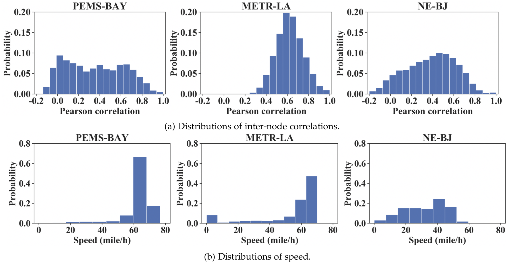
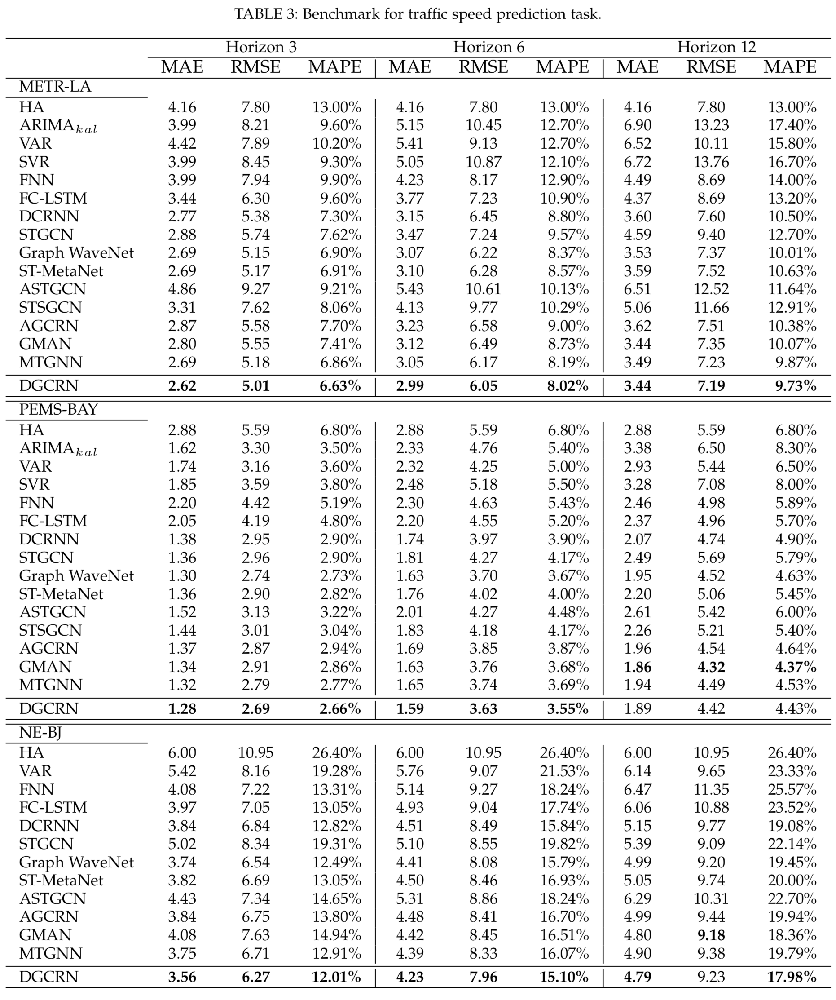

# Traffic Prediction Benchmark


This is the origin Pytorch implementation of DGCRN together with baselines in the following paper: 
- Fuxian Li, Jie Feng, Huan Yan, Guangyin Jin, Depeng Jin and Yong Li. [Dynamic Graph Convolutional Recurrent Network for Traffic Prediction: Benchmark and Solution](https://arxiv.org/abs/2104.14917). 

<p align="center">

<br><br>
<b>Figure 1.</b> The architecture of DGCRN.
</p>

## Model Classification
We classify the related works based on four parts: spatial topology construction, spatial dependency modeling, temporal dependency modeling and external features, as shown in the figure below, where the baselines in the benchmark are In bold type.

<p align="center">

<br><br>
<b>Figure 2.</b> The classification of related works .
</p>

## Requirements

- Python 3.6
- numpy == 1.19.4
- pandas == 1.1.1
- torch >= 1.1
- mxnet == 1.4.1
- tensorflow == 2.3.0

Dependencies can be installed using the following command:
```bash
pip install -r requirements.txt
```

## Data

- The description of METR-LA dataset and PEMS_BAY dataset please refers to the repository of [DCRNN](https://github.com/liyaguang/DCRNN).

- The NE-BJ dataset used in the paper can be downloaded, which will be available soon.

<p align="center">

<br><br>
<b>Figure 3.</b> Road segment distribution of the NE-BJ dataset.
</p>

<p align="center">

<br><br>
<b>Figure 4.</b> Comparisons among datasets.
</p>

## Usage
Commands for training model:

```bash
python train_benchmark.py --model 'model_name' --data 'data_name' >> log.txt 
```

More parameter information can be found in `train_benchmark.py` or the file in the directory of corrsponding model. You can refer to these parameters for experiments, and you can also adjust the parameters to obtain better results.


## <span id="resultslink">Results</span> 

<p align="center">

<br><br>
<b>Figure 5.</b>  Results of benchmark.
</p>


## <span id="citelink">Citation</span>
If you find this repository useful in your research, please consider citing the following paper:

```
@misc{li2021dynamic,
      title={Dynamic Graph Convolutional Recurrent Network for Traffic Prediction: Benchmark and Solution}, 
      author={Fuxian Li and Jie Feng and Huan Yan and Guangyin Jin and Depeng Jin and Yong Li},
      year={2021},
      eprint={2104.14917},
      archivePrefix={arXiv},
      primaryClass={cs.LG}
}
```

This repository will be updated and the code of DGCRN will be available soon.

Moreover, the PyTorch version of baselines like GMAN and STSGCN is on the way~

